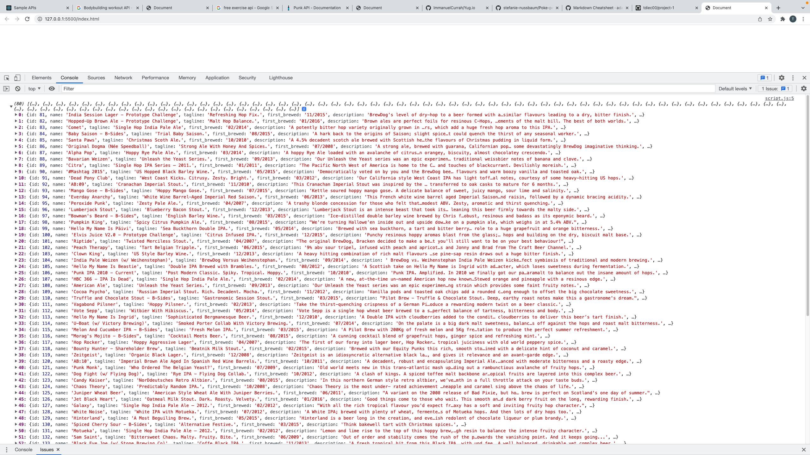
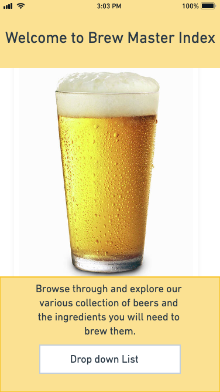
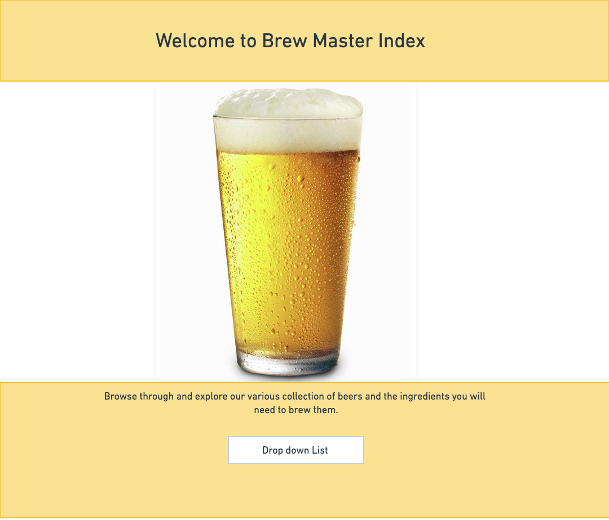
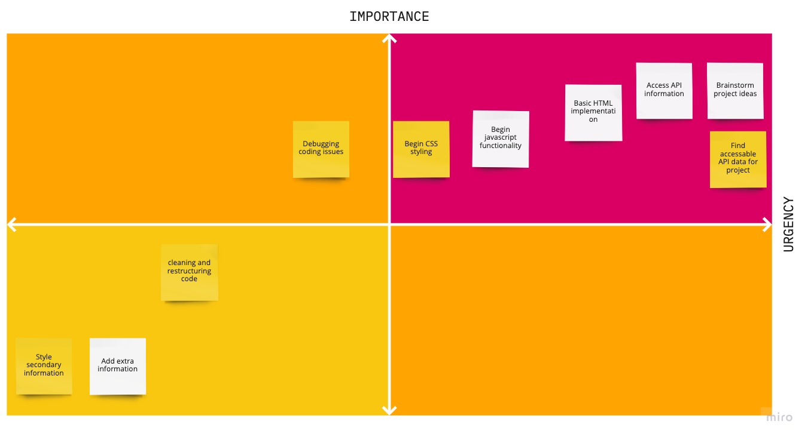

# Project Overview

## Project Name

Brew Master Index

## Project Description

My project will be a simple database that consists of random beers and recipes for beginners looking to brew batches of beer. The site will consist of a drop down menu with a list of beers. The beer choice will include a description and the ingredients required to brew it.

## API and Data Sample



## Wireframes

Wire frame for phone screen size



Wire frame for phone desktop screen size



### MVP/PostMVP

#### MVP

- Access data from api.
- Drop down menu with the list of beer names.
- Generate beer name, description, and ingredient information underneath dropdown menu.
- Style page with css flexbox.
- Compatability with phone and desktop screen sizes.

#### PostMVP

- Add favorites tab that saves choices of beers
- Add more information including abv, brewer tips, mash temp, and fermentation temp.
- Style new elements of page (favorites list, additional info, and favorites button)
- Add in functionality for tablet screen size.
- Favorites list has clickable links that will bring up favorite beers information
- Search section to search by ABV%

## Project Schedule

This schedule will be used to keep track of your progress throughout the week and align with our expectations.

You are **responsible** for scheduling time with your squad to seek approval for each deliverable by the end of the corresponding day, excluding `Saturday` and `Sunday`.

| Day       | Deliverable                                        | Status     |
| --------- | -------------------------------------------------- | ---------- |
| Dec 10-12 | Prompt / Wireframes / Priority Matrix / Timeframes | Complete   |
| Dec 13    | Project Approval                                   | Complete   |
| Dec 13    | Core Application Structure (HTML, CSS, etc.)       | Complete   |
| Dec 14    | Pseudocode / actual code                           | Complete   |
| Dec 15    | Initial Clickable Model                            | Complete   |
| Dec 16    | MVP                                                | Complete   |
| Dec 17    | Presentations                                      | Incomplete |

## Priority Matrix



## Timeframes

| Component                                                                    | Priority | Estimated Time | Time Invested | Actual Time |
| ---------------------------------------------------------------------------- | :------: | :------------: | :-----------: | :---------: |
| Basic HTML setup                                                             |    H     |     2.5hrs     |    0.5hrs     |             |
| Retreive data from API                                                       |    H     |     2.5hrs     |     1hrs      |             |
| Incorporate API info to DOM                                                  |    H     |      5hrs      |     6hrs      |             |
| Create form, dropdown list, and add submit/click listener                    |    H     |      3hrs      |     4hrs      |             |
| Create favorites button and save information to page                         |    M     |      4hr       |     3hrs      |             |
| Debugging API information and submit/click function                          |    M     |      3hrs      |     2hrs      |             |
| Set background image, style html, and buttons/dropdown boxes                 |    H     |      3hrs      |     4hrs      |             |
| CSS flexbox styling                                                          |    H     |      3hrs      |     9hrs      |             |
| Media query for different size screens                                       |    H     |     2.5hrs     |     3hrs      |             |
| Cleaning and refactoring code                                                |    M     |      3hrs      |     3hrs      |             |
| Additional information (abv, brewer tips, mash temp, and fermentation temp.) |    L     |      3hrs      |     2hrs      |             |
| Styling of new additional information                                        |    L     |      4hrs      |     3hrs      |             |
| Total:                                                                       |          |      38.5      |     40.5      |             |

## Code Snippet

Use this section to include a brief code snippet of functionality that you are proud of and a brief description.

```
function removeDups(obj) {
  let newArr = []
  // push values into new array
  let arr1 = obj.ingredients.hops
  for (let i = 0; i < arr1.length; i++) {
    arr2 = arr1[i].name;
    newArr.push(arr2)
  }
  //**found this code on youtube link "https://www.youtube.com/watch?v=dvPybpgk5Y4"**
  // removes duplicates and adds to new array
  obj = {};
  for (let i of newArr) {
    obj[i] = true;
  }
  let newArr2 = Object.keys(obj);
  showHops(newArr2);
}

There were duplicate values in the hops array, so I created a function to push those values into a new array, and remove duplicate values from the array to create a new array.
```

## Change Log

Decided not to add a background image.
Text structure and input boxes styled differently than initial wireframe.
Favorites list does not allow duplicates.
Alphabetized values in dropdown list.
